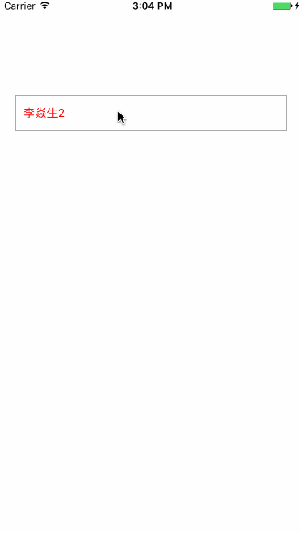

# LYSDropMenu
iOS下拉菜单

## 效果图

## 属性

###pragma mark - 每个Item高度
@property(nonatomic,assign)CGFloat itemH;

###pragma mark - 数据
@property(nonatomic,copy)NSArray<NSMutableDictionary*> *items;

###pragma mark - 显示最大的个数 - 如果items数量超过maxShowCount也只显示maxShowCount个item 但是可以滚动查看
@property(nonatomic,assign)NSUInteger maxShowCoun;

###pragma mark - 当前选中item的索引 
@property(nonatomic,assign)NSUInteger selectedIndex;

###pragma mark - 每个item对应的视图Class --如果需要自己定制化cell可以通过这个属性传进去
@property(nonatomic,assign)Class itemClazz;

###pragma mark - 主item对应的视图Class
@property(nonatomic,assign)Class mainItemClazz;

###pragma mark - 代理
@property(nonatomic,weak)id<LYSDropMenuDelegate> delegate;

## 方法

###pragma mark - 显示下拉列表
-(void)showDropDownMenu:(void(^)())completeBlock;

###pragma mark - 隐藏下拉菜单
-(void)hideDropDownMenu:(void(^)())completeBlock;

## LYSDropMenuDelegate代理类的方法

###pragma mark - 设置主itemview的样式
-(void)setMainItemViewStyle:(UIView*)view;

###pragma mark - 处理itemView
-(void)handleItemView:(UITableViewCell*)itemView item:(NSMutableDictionary*)item;

###pragma mark - 菜单被选中
-(void)itemDidSelected:(LYSDropMenu*)menu item:(NSMutableDictionary*)item;

###pragma mark - 下拉菜单即将出现
-(void)dropdownMenuWillShow:(LYSDropMenu*)menu;

###pragma mark - 下拉菜单已出现
-(void)dropdownMenuDidShow:(LYSDropMenu*)menu;

###pragma mark - 下拉菜单即将隐藏
-(void)dropdownMenuWillHide:(LYSDropMenu*)menu;

###pragma mark - 下拉菜单已隐藏
-(void)dropdownMenuDidHide:(LYSDropMenu*)menu;

###pragma mark - 更新mainview
-(void)updateMainItem:(UIView*)mainItemView item:(NSMutableDictionary*)item;

## 使用

-(LYSDropMenu*)dropMenu{
    if (!_dropMenu) {
        _dropMenu = [[LYSDropMenu alloc]initWithFrame:CGRectMake(20, 120, self.view.bounds.size.width - 40, 44.f)];
        _dropMenu.delegate = self;
        _dropMenu.layer.borderWidth = 1;
        _dropMenu.layer.borderColor = [UIColor lightGrayColor].CGColor;
        _dropMenu.maxShowCount = 4;
        _dropMenu.mainItemClazz = [UILabel class];
        _dropMenu.itemClazz = [MyCell class];

    }
    return _dropMenu;
}

 [self.view addSubview:self.dropMenu];
    self.dropMenu.selectedIndex = 3;
    self.dropMenu.items = @[@{@"name":@"李焱生1"},@{@"name":@"李焱生2"},@{@"name":@"李焱生3"},@{@"name":@"李焱生4"},@{@"name":@"李焱生5"},@{@"name":@"李焱生6"},@{@"name":@"李焱生7"},@{@"name":@"李焱生8"}];
    
    
    -(void)setMainItemViewStyle:(UIView*)view{
    if ([view isKindOfClass:[UILabel class]]) {
        UILabel *_mainView = ((UILabel *)view);
        _mainView.textColor = [UIColor redColor];
        _mainView.font = [UIFont systemFontOfSize:14];
        _mainView.frame = CGRectMake( 10 , 0, _mainView.superview.frame.size.width - 20, _mainView.superview.frame.size.height);
    }
//    view.backgroundColor = [UIColor redColor];
}

-(void)handleItemView:(UITableViewCell*)itemView item:(NSMutableDictionary *)item{
//    itemView.backgroundColor = [UIColor greenColor];
    if([itemView isKindOfClass:[MyCell class]]){
        ((MyCell *)itemView).item = item;
    }
}

-(void)itemDidSelected:(LYSDropMenu*)menu item:(NSMutableDictionary*)item{
    NSLog(@"you picked %@",item);
}

-(void)dropdownMenuWillShow:(LYSDropMenu*)menu{
    NSLog(@"dropdownMenuWillShow");
}

-(void)dropdownMenuDidShow:(LYSDropMenu*)menu{
    NSLog(@"dropdownMenuDidShow");
}

-(void)dropdownMenuWillHide:(LYSDropMenu*)menu{
    NSLog(@"dropdownMenuWillHide");
}

-(void)dropdownMenuDidHide:(LYSDropMenu*)menu{
    NSLog(@"dropdownMenuDidHide");
}

-(void)updateMainItem:(UIView *)mainItemView item:(NSMutableDictionary *)item{
    if ([mainItemView isKindOfClass:[UILabel class]]) {
        ((UILabel *)mainItemView).text = [item objectForKey:@"name"];
    }
}
